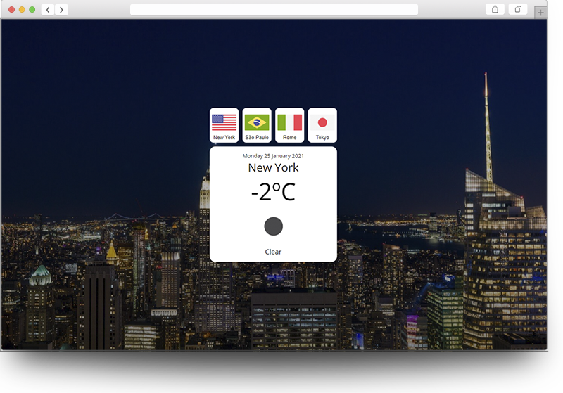

# About this app

This project is a ReactJS project that shows the weather in 4 cities: New York, São Paulo, Rome and Tokyo. There are buttons with the flags that you can click to switch between them. When you click, the background changes according to the weather and if it's night or day. You can also check temperature in celsius.

This was developed from a tutorial for study purposes:
https://www.youtube.com/watch?v=GuA0_Z1llYU

# Live Demo
If you're like me and is always in a rush, just see the live demo, with no need to clone the project and set up the enviroment:
<a href="https://andressabertolini.github.io/weather-app/" target="_blank">https://andressabertolini.github.io/weather-app/</a>
  

# How to execute

1. You need to download and install node.js 

2. Run in your console:
- npm install
- npm start

That's all folks,

Thank you :)

Keep learning
